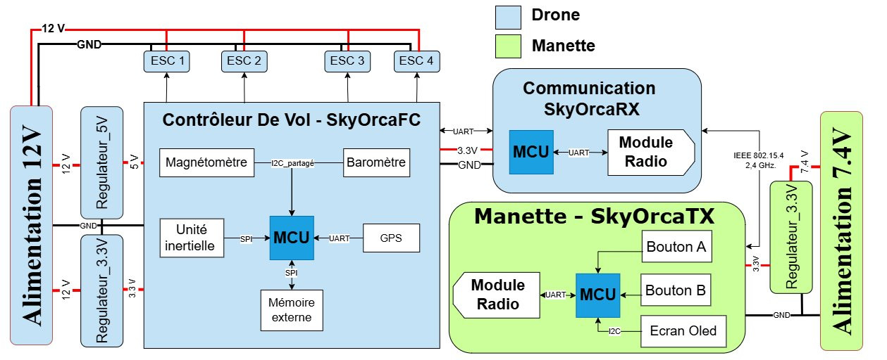

# SkyOrca — Quadcopter Drone Hardware

<p align="center">
  
</p>

<p align="center">
  
  
  
  
  
</p>

> **SkyOrca** is a fully custom quadcopter drone system designed from scratch at ENSI (Tunisia), in partnership with [LAB619 Engineering & Consulting Services](https://lab619.tn). This repository contains the complete hardware design — schematics, PCB layouts, Gerber files, and BOMs — for all three boards.

---

## System Overview

SkyOrca is built around three custom PCBs that together form a complete drone flight & control chain:

| Board | Role | MCU | Dimensions |
|-------|------|-----|------------|
| **SkyOrcaFC** | Flight Controller | STM32F405RGTx @ 168 MHz | 60 × 50 mm |
| **SkyOrcaTX** | Remote Controller (Transmitter) | ATmega328P-P @ 8 MHz | 50 × 35 mm |
| **SkyOrcaRX** | Communication Module (Receiver) | ATmega2560-16A @ 8 MHz | 30 × 25 mm |

---

## Repository Structure

```
SkyOrca-Hardware/
├── hardware/
│   ├── SkyOrcaFC/              # Flight Controller Board
│   │   ├── kicad/              # KiCad project files (.kicad_pro, .kicad_sch, .kicad_pcb)
│   │   ├── gerbers/            # Production Gerber files + drill files
│   │   └── bom/                # Bill of Materials (CSV + interactive iBOM)
│   ├── SkyOrcaTX/              # Remote Controller Board
│   │   ├── kicad/
│   │   ├── gerbers/
│   │   └── bom/
│   └── SkyOrcaRX/              # Receiver Module
│       ├── kicad/
│       └── bom/
├── docs/
│   ├── images/                 # architecture_drawio.png + board renders
│   ├── SkyOrcaFC.md
│   ├── SkyOrcaTX.md
│   ├── SkyOrcaRX.md
│   └── design_decisions.md
├── .gitignore
├── LICENSE
└── README.md
```

---

## Board Details

### SkyOrcaFC — Flight Controller

The brain of the drone. Reads all sensors, runs stabilization algorithms, and drives the four ESCs.

**Key components:**
- **MCU:** STM32F405RGTx — Cortex-M4F @ 168 MHz, hardware FPU (quaternion math, sensor fusion at 400 Hz)
- **IMU:** MPU-6000 — SPI @ 20 MHz, DMA-triggered via EXTI interrupt, 400 Hz control loop
- **Barometer:** MS5611-01BA — 10 cm altitude resolution, I²C shared bus
- **Magnetometer:** HMC5883L — I²C shared bus
- **GPS:** u-blox MAX-M10S — multi-constellation (GPS/GLONASS/Galileo/BeiDou), UART
- **Flash:** W25Q128JVS — 128 Mbit, SPI @ 133 MHz, flight data logging
- **Power:** Dual TPS5430DDA buck converters (12V→5V and 12V→3.3V)
- **PCB:** 4-layer, 60×50 mm (rev 2), manufactured by JLCPCB

> **PCB revisions:** The first revision (50×50 mm) was redesigned due to GPS/DC-DC proximity and thermal density issues. See [`docs/SkyOrcaFC.md`](docs/SkyOrcaFC.md) for the full analysis.

---

### SkyOrcaTX — Remote Controller

Hand-held transmitter reading pilot inputs and displaying telemetry.

**Key components:**
- **MCU:** ATmega328P-P @ 8 MHz (DIP-28)
- **Radio:** XBee 802.15.4 module — bidirectional, up to 1.6 km range, UART interface
- **Inputs:** 2× analog joysticks (4-axis), 2 buttons
- **Display:** OLED (I²C) — battery level, altitude, RSSI
- **Power:** TPS5430DDA buck converter (7.4V→3.3V)
- **PCB:** 4-layer, 50×35 mm

---

### SkyOrcaRX — Receiver Module

On-board radio bridge between the XBee link and the Flight Controller.

**Key components:**
- **MCU:** ATmega2560-16A @ 8 MHz — 4 hardware UARTs (radio / FC link / debug / spare)
- **Radio:** XBee 802.15.4 module
- **Interface to FC:** UART2 → `IBUS_RX_MCU` on SkyOrcaFC
- **Power:** 3.3V supplied directly by SkyOrcaFC
- **PCB:** 4-layer, 30×25 mm

---

## Inter-Board Communication

| Link | Signal | Protocol |
|------|--------|----------|
| TX → RX (commands) | XBee RF 2.4 GHz | IEEE 802.15.4 |
| RX → FC (commands) | `UART2` → `IBUS_RX_MCU` | UART |
| FC → TX (telemetry) | `MSP_TX_MCU` → XBee → `RXD_MCU` | UART + XBee RF |
| FC → ESC 1–4 | `Signal_ESC1–4` | PWM |

All three boards share a **3.3V logic level**, eliminating any need for level shifters between STM32 and ATmega devices.

---

## Getting Started

### Prerequisites

- [KiCad 9.0.x](https://www.kicad.org/download/) to open and edit the project files

### Opening a Project

```bash
git clone https://github.com/mohamedaminemb/SkyOrca-Hardware.git
cd SkyOrca-Hardware

# Open the Flight Controller in KiCad
kicad hardware/SkyOrcaFC/kicad/flightcontrolerPCB.kicad_pro
```

### Ordering PCBs (SkyOrcaFC)

Upload `hardware/SkyOrcaFC/gerbers/gerbers_production.zip` to [JLCPCB](https://jlcpcb.com):

| Setting | Value |
|---------|-------|
| Layers | **4** |
| PCB thickness | **1.6 mm** |
| Surface finish | **HASL (lead-free)** or **ENIG** |
| Min trace/space | **0.15 / 0.15 mm** |

---

## Design Philosophy

This project follows a **hardware/software co-design** methodology. Every component choice is directly motivated by firmware constraints. See [`docs/design_decisions.md`](docs/design_decisions.md) for the full rationale.

---

## Project Context

SkyOrca is a design and development project (PCD) at **ENSI** (École Nationale des Sciences de l'Informatique, Tunisia), developed in the context of Tunisia's first civil drone legislation (Finance Law 2026, Article 135), in collaboration with **LAB619 Engineering & Consulting Services**.

**Team:** Mohamed Amine Embarki · Hamza Soltani  
**Supervisors:** Mme. Chadha Jerad · M. Jawher Mansour (LAB619)  
**Tools:** KiCad 9.0.4 · JLCPCB

---

## License

Hardware designs are released under the **CERN Open Hardware Licence v2 – Strongly Reciprocal (CERN-OHL-S)**.  
See [`LICENSE`](LICENSE) for details.

---

