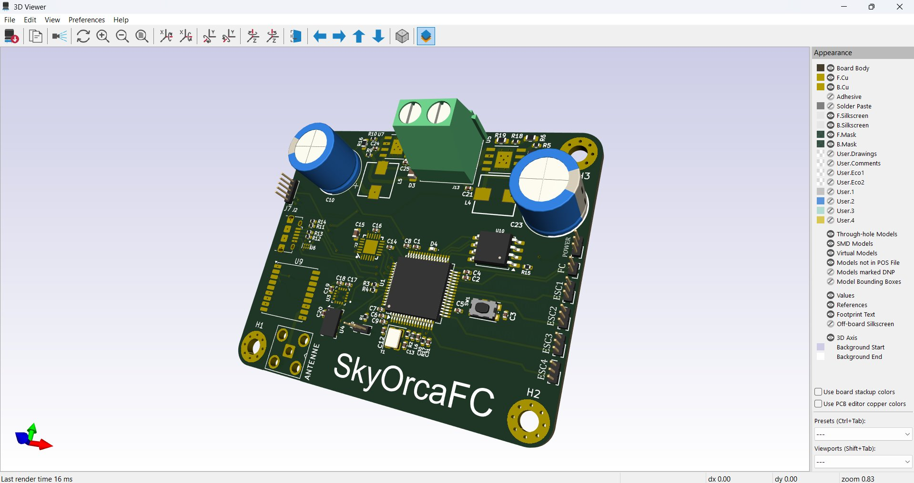
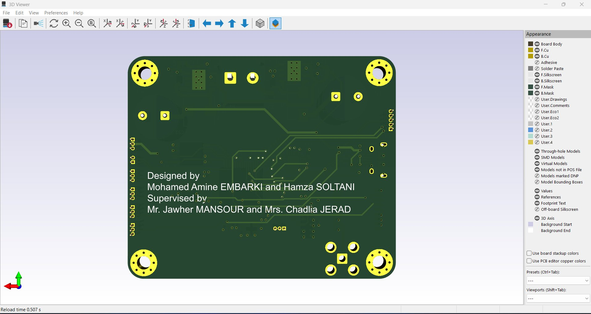
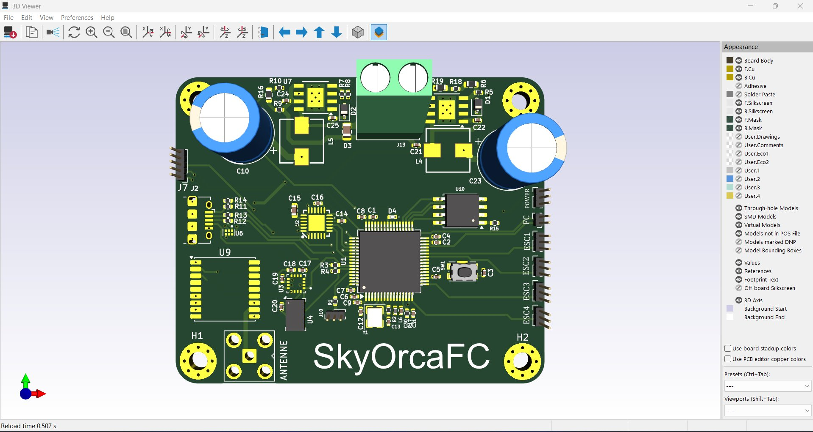
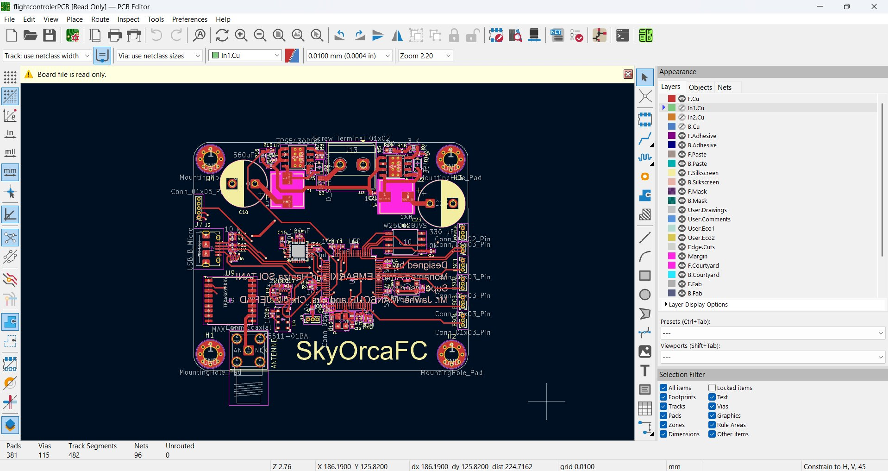
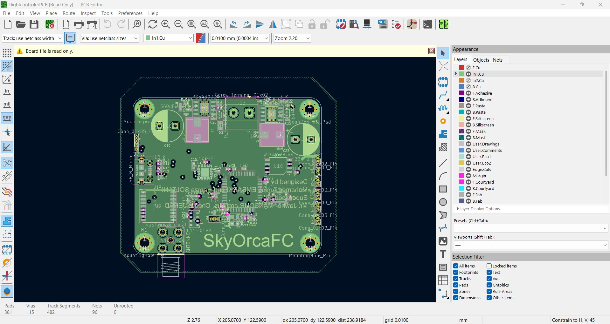
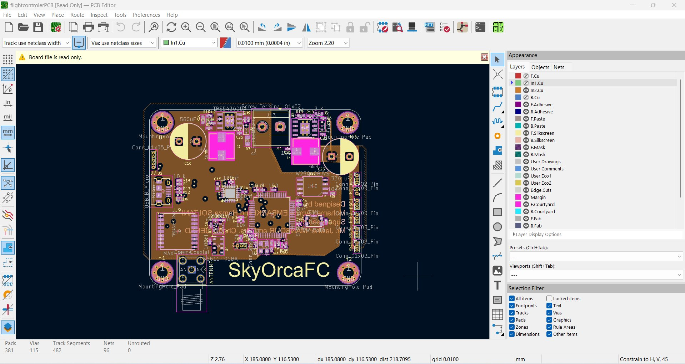
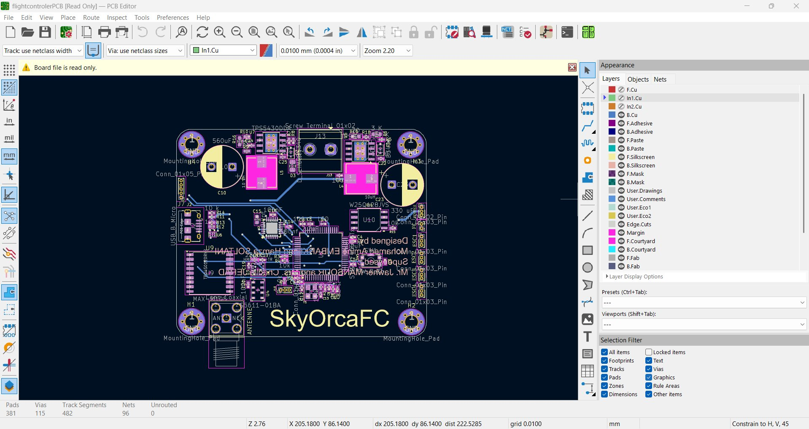

# SkyOrcaFC — Flight Controller Board

> Full design documentation: [`docs/SkyOrcaFC.md`](../../docs/SkyOrcaFC.md)

## Quick Specs

| Parameter | Value |
|-----------|-------|
| MCU | STM32F405RGTx |
| Dimensions | 60 × 50 mm |
| Layers | 4 |
| Power input | 12V (LiPo 3S) |
| Control loop | 400 Hz (DMA, IMU interrupt) |
| Revision | 2 (production) |

---

## 3D Views

| Front | Back |
|-------|------|
|  |  |



---

## PCB Layers

| Layer | Preview |
|-------|---------|
| **F.Cu** — Front copper (signal + components) |  |
| **In1.Cu** — Ground plane |  |
| **In2.Cu** — Power plane (3.3V / 5V) |  |
| **B.Cu** — Back copper (signal) |  |

---

## Contents

```
SkyOrcaFC/
├── kicad/
│   ├── flightcontrolerPCB.kicad_sch    # Schematic
│   ├── flightcontrolerPCB.kicad_pcb    # PCB layout (4-layer, 60×50 mm)
│   └── schematic.pdf                   # Schematic PDF
└── docs/images/SkyOrcaFC/              # 3D renders + layer screenshots
```

## Ordering
## Ordering

Upload the Gerber zip to [JLCPCB](https://jlcpcb.com):

| Setting | Value |
|---------|-------|
| Layers | **4** |
| PCB thickness | **1.6 mm** |
| Surface finish | **HASL (lead-free)** or **ENIG** |
| Min trace/space | **0.15 / 0.15 mm** |
